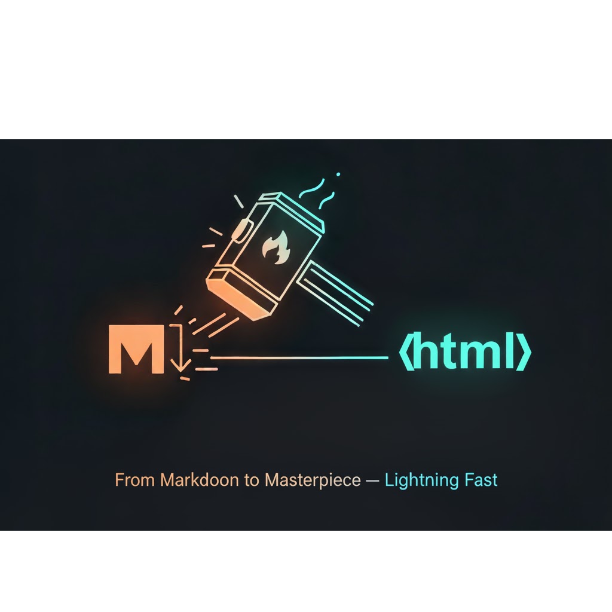
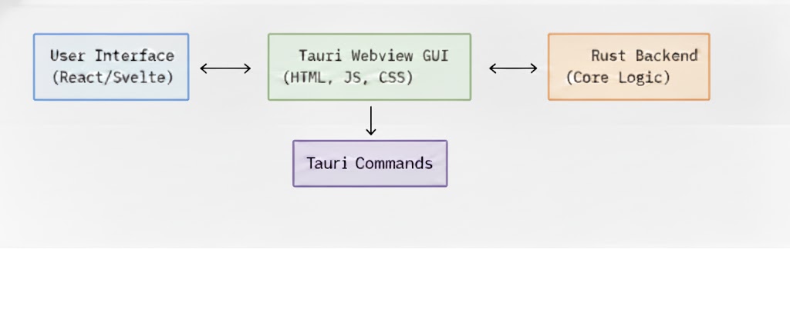

<div align="center">

# mdForge  
### ⚙️ *A High-Performance Static Site Generator GUI*

> Transform Markdown into fully-fledged static websites — powered by **Rust** and **Tauri**.



---

</div>

## 🧩 Tech Stack

<p align="center">
  
  
  
  
  
  
  
</p>

---

## 🌟 Overview

**mdForge** is a modern, cross-platform desktop application designed to simplify the process of generating static HTML websites from Markdown files.  
It eliminates the need for complex command-line tools by providing a sleek **Graphical User Interface (GUI)** — all backed by **Rust’s speed and security**.

Built using the **Tauri framework**, mdForge combines a **high-performance Rust backend** with a **flexible web frontend** (React, Svelte, or Vue) for a native experience on **Windows, macOS, and Linux**.

---

## 🏗️ Technical Architecture

<p align="center">
  
</p>

### 🔧 Core Components

| Component | Purpose | Key Crates / Tools |
|------------|----------|-------------------|
| **`error.rs`** | Structured Error Handling | `thiserror`, `serde` |
| **`markdown_processor.rs`** | Markdown → HTML Conversion | `pulldown-cmark` |
| **`site_generator.rs`** | HTML templating, file coordination | `tera`, `std::fs` |
| **`file_manager.rs`** | File I/O abstraction and management | `std::fs` |

---

### 🧠 Tauri Command Bridge (IPC)

The app uses **Tauri's IPC system** to expose Rust functions directly to the frontend.

#### Implemented Commands
- `generate_site` — Build the complete static site  
- `save_file` — Save Markdown edits directly to disk  
- `render_live_preview` — Provide real-time HTML previews  

---

## ✨ Feature Set

- 🪶 **Live Markdown Preview:** Real-time rendered output as users type.  
- 🧩 **HTML Templating:** Uses Tera templates for consistent site layouts.  
- 📁 **Static Asset Copying:** Automatically copies `.css`, `.js`, and `.png` files to output.  
- 💻 **User-Friendly GUI:** Simple folder selection, progress logs, and clear UI feedback.  
- ⚡ **Cross-Platform:** Runs seamlessly on Windows, macOS, and Linux.  

---

## 🧭 Future Enhancements

🚧 **Planned for Next Release:**
- 📂 Recursive Subfolder Support (`walkdir` crate)  
- 🧱 Custom Themes & Templates  
- ⚙️ Configurable Build Settings (via JSON/YAML)  

---

## ⚙️ Installation

```bash
# Clone the repository
git clone https://github.com/your-username/mdForge.git
cd mdForge

# Install dependencies
npm install

# Run the development build
npm run tauri dev
```

---

## 🧪 Development Scripts

```bash
# Lint the project
npm run lint

# Build production package
npm run tauri build
```

---

## 📜 License

This project is licensed under the **MIT License**.  
See the [LICENSE](LICENSE) file for details.

---

## 🙌 Acknowledgements

- [Tauri](https://tauri.app) — Lightweight desktop app framework  
- [pulldown-cmark](https://github.com/raphlinus/pulldown-cmark) — Markdown parsing  
- [Tera](https://tera.netlify.app/) — Templating engine  
- [Rust](https://www.rust-lang.org/) — Safety and performance  

---

<div align="center">
  <sub>🌙 Built with Rust & Passion — Moaz M.</sub>
</div>
